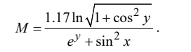

# Programming with Linear and Branching Algorithms

## Tasks for Variant №3

Four tasks were implemented as part of this work:

### a) Calculate the area of a circle

The program calculates the area of a circle, which is defined by a circumference length provided by the user.

### b) Queen's move on a chessboard

The chessboard has a size of 8x8. The squares are defined by coordinates: the first is the file number (from left to right), and the second is the rank number (from bottom to top). The user provides four natural numbers: `a`, `b`, `c`, `d`.

The program determines if a queen can move from square `(a, b)` to square `(c, d)` in a single move. If not, it attempts to determine if the move can be made in two steps. Corresponding messages are displayed on the screen.

### c) Check if a number is within an interval

The program checks whether an integer number entered from the keyboard belongs to the interval `(1.3; 10.23]`.

### d) Calculate the value of an expression

The program calculates the value of the expression `M` for the integer values `x` and `y` provided by the user.

The formula for the calculation is:

---

# Программирование на основе линейных и разветвленных алгоритмов

## Задания для варианта №3

В рамках этой работы было реализовано четыре задачи:

### а) Вычисление площади круга

Программа вычисляет площадь круга, ограниченного окружностью, длину которой задает пользователь.

### б) Ход ферзя на шахматной доске

Поле шахматной доски имеет размер 8x8. Клетки определяются координатами: первая — номер вертикали (слева направо), вторая — номер горизонтали (снизу вверх). Пользователем задаются натуральные числа `a`, `b`, `c`, `d`.

Программа выясняет, можно ли с поля `(a, b)` одним ходом ферзя попасть на поле `(c, d)`. Если нет, то программа пытается выяснить, можно ли это сделать за два хода. На экран выводятся соответствующие сообщения.

### в) Проверка принадлежности к интервалу

Программа проверяет, принадлежит ли введенное с клавиатуры целое число интервалу `(1.3; 10.23]`.

### г) Вычисление значения выражения

Программа вычисляет значение выражения `M` для заданных пользователем целых чисел `x` и `y`.

Формула для вычисления:

